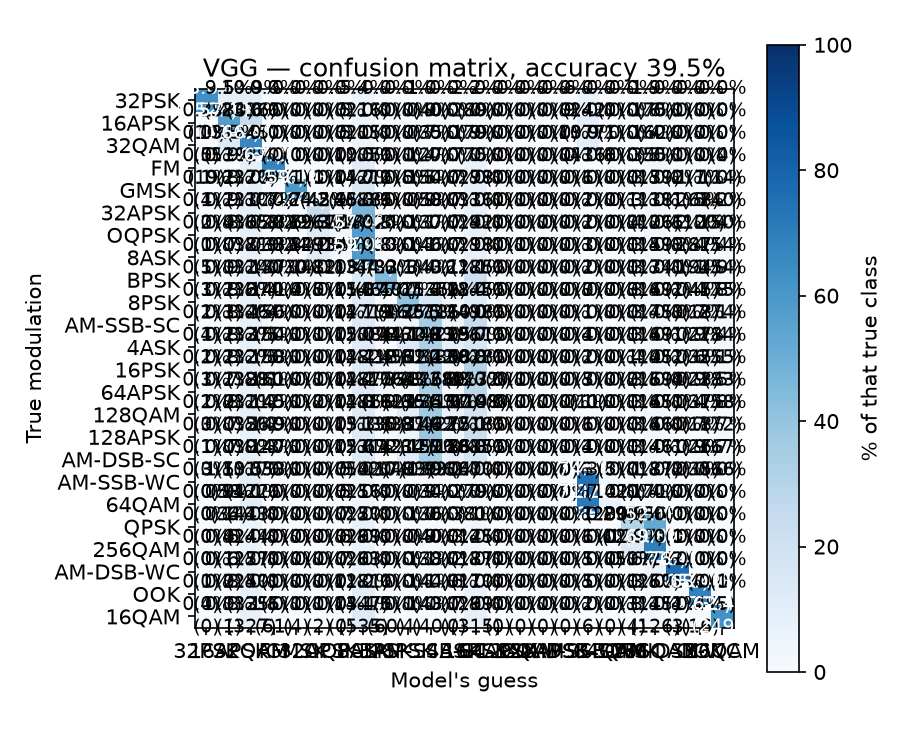
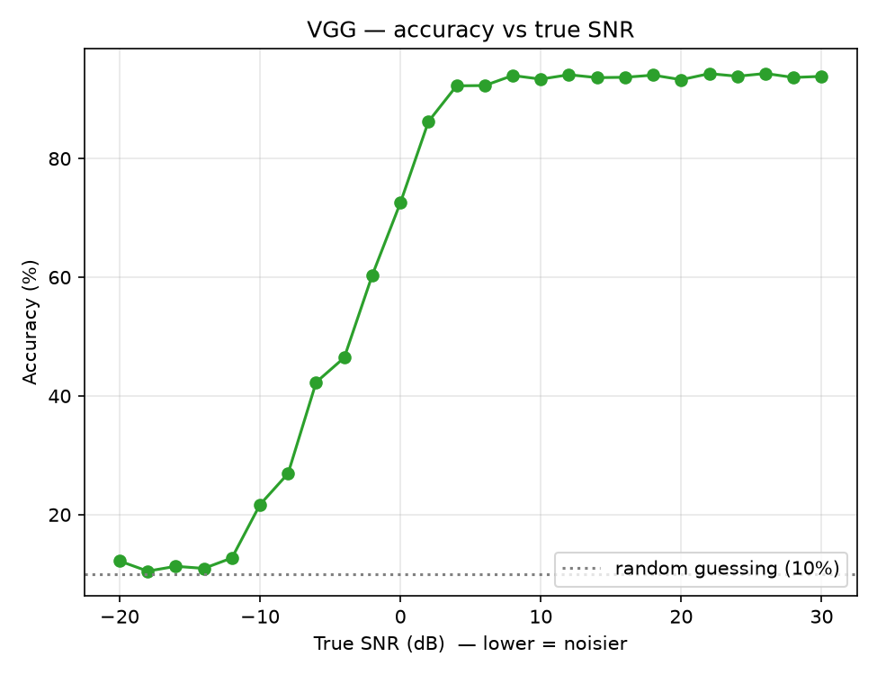

# Radio modulation classification with a 1D CNN

Given a raw 1024-sample I/Q radio snippet, which modulation scheme produced it?

This is a replication of the VGG-style convolutional network (and its ResNet
variant) from O'Shea, Roy & Clancy, *[Over the Air Deep Learning Based Radio Signal
Classification](https://arxiv.org/abs/1712.04578)* (IEEE J-STSP, 2018), built as a
hands-on way to learn deep learning. It grew in three phases: a **3-class** warm-up
on a laptop CPU (81.1%), a **10-class** scale-up with a refuse-to-answer gate
(66.3% → 90% gated), and the **full 24-class replication** on a free Colab GPU —
the paper's actual scope.

> **Status:** all three phases complete, documented, and reproducible end-to-end.
> Actively being extended — see [Currently extending](#currently-extending) below
> for what's running next.

| | |
|---|---|
| **Full replication (24 classes)** | VGG **39.5%** / ResNet **48.7%** on 96,000 held-out (chance = 4.2%) |
| **ResNet finally pulls ahead** | +9.2 points over VGG — and learns all 24 classes; VGG **never predicts 4 of them** |
| **10-class + gate** | **66.3%** → **90% accurate while answering 68%** of signals |
| **Warm-up (3 classes)** | **81.1%** — 99.4% on clean signals, ~42% on the noisiest third |
| **Models** | VGG-style 1D CNN (159,818–168,216 params) and its ResNet variant |
| **Hardware** | 12-core CPU (Phases 1–2) → free Colab T4 GPU (Phase 3) |

At 10 classes, architecture barely mattered — VGG and ResNet tied, because noise was
the ceiling. At the **full 24 classes**, that breaks: VGG completely gives up on four
hard, look-alike classes (`64APSK`, `128QAM`, `128APSK`, `AM-DSB-SC` — precision *and*
recall of 0.000, never once predicted), dumping their errors into three other classes.
ResNet learns all 24. That shift — from "architecture is a minor detail" to
"architecture is the difference between learning a class or not" — is the project's
biggest finding. Full story in the [reports](report/README.md).



## The class sets

Three runs, growing scope: an easy **3-class** warm-up, a curated **10-class** set
chosen to span the major families, then the dataset's **full 24 classes** for the
real replication. The 24-class list is in the
[full replication report](report/full-24class/README.md); the curated 10 (still the
set `gate.py`'s refuse-to-answer demo uses) were chosen with two deliberately
*confusable* "ladders" so the confusion matrix shows real structure, plus distinct
anchors that stay easy to tell apart:

| Class | Family | Role |
|---|---|---|
| `OOK` | amplitude (on/off) | easy anchor |
| `BPSK`, `QPSK`, `8PSK` | phase-shift keying | **PSK ladder** (look alike) |
| `16QAM`, `64QAM`, `256QAM` | quadrature-amplitude | **QAM ladder** (look alike) |
| `FM` | analog frequency | easy anchor |
| `GMSK` | GSM / legacy cellular | — |
| `AM-DSB-WC` | analog amplitude | easy anchor |

Following the paper's central thesis, the network sees **raw I/Q samples only** —
no Fourier transform, no hand-crafted features. It learns its own.

## Knowing when not to answer

*(From the 10-class phase — the refuse-to-answer gate hasn't been extended to the
full 24-class run yet; see [Next](report/full-24class/README.md#next).)*

Forcing a guess on a signal that noise has already destroyed is a mistake. The
model reports how confident it is, so `scripts/gate.py` lets it **abstain** when
that confidence is low — "too noisy, I won't answer." Tuned to stay 90% accurate
*when it answers*, it still responds to **68% of signals** and quietly drops the
rest (vs 66% if forced to guess on everything).

That the gate really is filtering by noise — not luck — is provable: the dataset's
ground-truth SNR (signal-to-noise ratio) shows the answered signals have a median
of **+14 dB** and the abstained ones **−12 dB**. Plotting accuracy against true SNR
reproduces the paper's classic S-curve.



## Architecture

```
Input  1024 x 2  (I/Q)
7 x [ Conv1D(64, kernel 3, ReLU) -> BatchNorm -> MaxPool /2 ]   1024 -> 512 -> ... -> 8
Flatten                                                          512
Dense(128, SELU) -> AlphaDropout
Dense(128, SELU) -> AlphaDropout
Dense(N, Softmax)          # N = 3, 10, or 24 depending on the phase
```

Layer-for-layer the paper's Table III. Trained with Adam and cross-entropy, stopping
when validation loss stops improving — the paper's stated recipe. Only the final
layer's width changes with the number of classes; the script sizes it automatically
from `classes.txt`, so the same code trained all three phases.

## Repository layout

```
scripts/
  data_prep.py     memory-maps the 19.5 GB dataset, samples N examples per class
                   (--all-24 / --per-class), normalizes, 80/20 stratified split
  model.py         the VGG CNN (run directly to print the architecture)
  resnet_model.py  the ResNet variant with skip connections
  train.py         training with early stopping + best-model checkpointing
  evaluate.py      accuracy, precision/recall, confusion matrix, confidence check
  gate.py          refuse-to-answer gate: risk-coverage + accuracy-vs-SNR curves
  high_snr.py      scores VGG and ResNet on the clean, high-SNR slice (paper-style)
  colab_pipeline.py  trains + evaluates both models back-to-back (used on the GPU)
colab/
  train_24class.ipynb  notebook that runs the pipeline on a free Colab GPU
prepared/          the sampled + split arrays produced by data_prep.py
                   (X_train/X_test/y_train/y_test.npy, snr_*.npy, classes.txt)
models/            trained weights — vgg.keras, resnet.keras
report/            write-ups, one folder per phase (interactive HTML + markdown)
  README.md          index linking all three phase reports
  warmup-3class/     Phase 1 — the 3-class warm-up (81.1%)
  scaleup-10class/   Phase 2 — 10 classes + refuse-to-answer gate
  full-24class/      Phase 3 — the full 24-class replication (Colab GPU)
results/           generated figures
Data/              the raw RadioML dataset (gitignored — see Setup)
```

## Setup

Requires Python 3.12 and the DeepSig RadioML 2018.01A dataset.

```bash
python3 -m venv .venv
.venv/bin/pip install tensorflow scikit-learn matplotlib
```

Place the dataset in `Data/` (gitignored — it is ~19.5 GB and non-commercially
licensed):

```
Data/
  signals.npy        (2555904, 1024, 2) float32   raw I/Q
  labels.npy         (2555904, 24)      float32   one-hot
  classes.txt        the 24 class names, in label-column order
```

`signals.npy` will not fit in RAM. `data_prep.py` memory-maps it and reads only
the rows it needs.

## Running

10-class, on a CPU laptop (~15 min/model):
```bash
.venv/bin/python scripts/data_prep.py   # ~20 seconds (pulls 80,000 examples)
.venv/bin/python scripts/train.py       # ~15 minutes on CPU (10 classes)
.venv/bin/python scripts/evaluate.py    # metrics + confusion matrix
.venv/bin/python scripts/gate.py        # refuse-to-answer gate + SNR curves
```

Full 24-class, best done on a GPU (~25 min for both models):
```bash
.venv/bin/python scripts/data_prep.py --all-24 --per-class 20000   # ~480k examples
# then open colab/train_24class.ipynb in Colab (Runtime -> GPU), or run
# scripts/colab_pipeline.py / train.py+evaluate.py+high_snr.py locally on a GPU
```

Add `--model resnet` to `train.py`/`evaluate.py`/`gate.py` to run the residual
network instead. `gate.py` takes `--target-accuracy` to tune how strict it is.

## Architectures built

**10 classes (CPU):** VGG 66.3%, ResNet 67.5% — only ~1% apart, because the
bottleneck was data quality (noise), not the model. Scored the paper's way, on
**clean, high-SNR signals only** (≥ +18 dB), both reach **~94%** (`scripts/high_snr.py`)
— the 66–67% headline looks far below the paper's 98.3%/99.8% only because it
averages in hopeless sub-0 dB signals the paper's peak number excludes.

**All 24 classes (GPU):** VGG **39.5%**, ResNet **48.7%** — a **9.2-point** gap, and
a qualitative one: VGG never predicts 4 of the 24 classes (precision *and* recall of
0.000), while ResNet learns all 24. At this scale, **architecture stops being a minor
detail.** Full breakdown, including the garbage-can effect and why these specific four
classes collapse, in the [full replication report](report/full-24class/README.md).

## Currently extending

The 24-class run used 20,000 examples/class — a deliberate tradeoff for a
~25-minute Colab budget, and the likely reason VGG collapses on its four hardest
classes and neither model matches the paper's high-SNR numbers (details in the
[full replication report](report/full-24class/README.md#against-the-paper)). The
next experiment tests that diagnosis directly: **more data, same architecture,
same everything else.**

- `data_prep.py` was refactored to split-then-read instead of read-then-split,
  roughly halving peak RAM — the change that makes preparing significantly more
  data on a 15 GB laptop actually feasible (verified: correct stratified splits,
  no data loss, same reproducible seed behavior).
- **40,000/class (960k examples)** and **60,000/class (1.44M examples, ~57% of the
  paper's own per-class density)** are already prepared, bundled, and ready to train
  — `colab/train_24class.ipynb` now takes one variable (`PAYLOAD_NAME`) to switch
  between data sizes, with results saved to a separate namespaced folder per run so
  nothing overwrites a prior experiment.
- Question being tested: does more data alone close the gap on the four collapsed
  classes, or is it (also) an architecture/training-budget limit? Either answer is
  useful — this project's throughline has been "diagnose the actual bottleneck,
  don't just add compute and hope."

## Not built (yet)

The paper covers three methods; this repo implements the two deep-learning ones:

- **XGBoost baseline** on higher-order moments — the classical-features comparison.
- **Over-the-air capture and transfer learning** — requires software-defined radio
  hardware.

## Credits

Dataset: [DeepSig RadioML 2018.01A](https://www.deepsig.ai/datasets), licensed
CC BY-NC-SA 4.0 — non-commercial use, attribution required.

Paper: T. J. O'Shea, T. Roy, and T. C. Clancy, "Over the Air Deep Learning Based
Radio Signal Classification," *IEEE Journal of Selected Topics in Signal
Processing*, vol. 12, no. 1, pp. 168–179, 2018.
