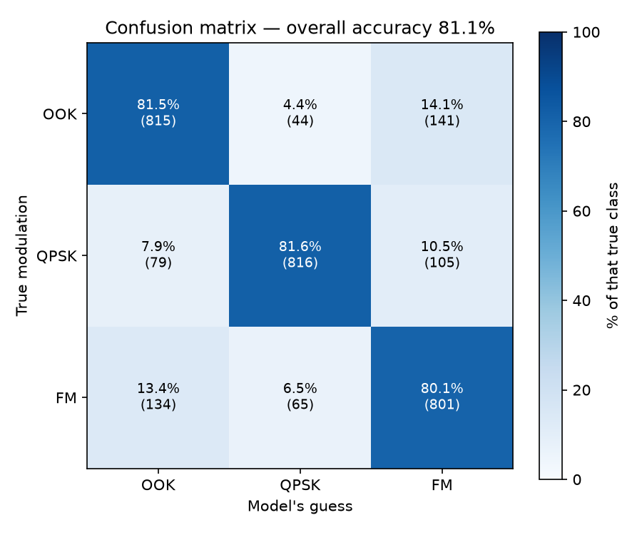

# Radio modulation classification with a 1D CNN

Given a raw 1024-sample I/Q radio snippet, which modulation scheme produced it?

This is a scaled-down replication of the VGG-style convolutional network from
O'Shea, Roy & Clancy, *[Over the Air Deep Learning Based Radio Signal
Classification](https://arxiv.org/abs/1712.04578)* (IEEE J-STSP, 2018), built as a
hands-on way to learn deep learning. The paper classifies 24 modulations using
2.55M examples on a V100 GPU; this trains on **3 modulations** and **15,000
examples** in about five minutes on a CPU laptop.

| | |
|---|---|
| **Test accuracy** | **81.1%** on 3,000 held-out examples |
| **On the cleaner 60% of signals** | **99.4%** — matches the paper's high-SNR result |
| **On the noisiest 30%** | ~42%, where random guessing is 33% |
| **Model** | VGG-style 1D CNN, 158,915 parameters |
| **Hardware** | 12 CPU cores, no GPU |

That 81% is an average of two very different regimes: near-perfect where the
signal is clean, near-chance where noise has destroyed the modulation before
capture. Splitting them apart turned out to be the most interesting part of the
project — see the [full report](report/README.md).



## The three classes

Picked to be physically distinct, for an encouraging first result.

| Class | Full name | How it carries data |
|---|---|---|
| `OOK` | On-Off Keying | switches the carrier on and off |
| `QPSK` | Quadrature Phase-Shift Keying | jumps between four phase angles |
| `FM` | Frequency Modulation | bends the carrier frequency continuously |

Following the paper's central thesis, the network sees **raw I/Q samples only** —
no Fourier transform, no hand-crafted features. It learns its own.

## Architecture

```
Input  1024 x 2  (I/Q)
7 x [ Conv1D(64, kernel 3, ReLU) -> BatchNorm -> MaxPool /2 ]   1024 -> 512 -> ... -> 8
Flatten                                                          512
Dense(128, SELU) -> AlphaDropout
Dense(128, SELU) -> AlphaDropout
Dense(3, Softmax)
```

Layer-for-layer the paper's Table III, with the output head narrowed from 24
classes to 3. Trained with Adam and cross-entropy, stopping when validation loss
stops improving — the paper's stated recipe.

## Repository layout

```
scripts/
  data_prep.py     memory-maps the 19.5 GB dataset, pulls 5,000 examples per
                   class, normalizes to unit variance, 80/20 stratified split
  model.py         the VGG CNN (run directly to print the architecture)
  resnet_model.py  the ResNet variant with skip connections
  train.py         training with early stopping + best-model checkpointing
  evaluate.py      accuracy, precision/recall, confusion matrix, confidence check
prepared/          the sampled + split arrays produced by data_prep.py
                   (X_train/X_test/y_train/y_test.npy, classes.txt)
models/            trained weights — vgg_3mod.keras, resnet_3mod.keras
report/            full write-up (HTML with interactive charts + markdown summary)
results/           generated figures
Data/              the raw RadioML dataset (gitignored — see Setup)
```

## Setup

Requires Python 3.12 and the DeepSig RadioML 2018.01A dataset.

```bash
python3 -m venv .venv
.venv/bin/pip install tensorflow scikit-learn matplotlib
```

Place the dataset in `Data/` (gitignored — it is ~19.5 GB and non-commercially
licensed):

```
Data/
  signals.npy        (2555904, 1024, 2) float32   raw I/Q
  labels.npy         (2555904, 24)      float32   one-hot
  classes.txt        the 24 class names, in label-column order
```

`signals.npy` will not fit in RAM. `data_prep.py` memory-maps it and reads only
the rows it needs.

## Running

```bash
.venv/bin/python scripts/data_prep.py   # ~5 seconds
.venv/bin/python scripts/train.py       # ~5 minutes on CPU
.venv/bin/python scripts/evaluate.py    # metrics + confusion matrix
```

## Architectures built

- **VGG CNN** — 81.1% test accuracy, 158,915 parameters
- **ResNet** — 82.1% test accuracy, 165,507 parameters (skip connections add 1% via easier training, but both hit the same noise ceiling)

The paper achieves 98.3% (VGG) and 99.8% (ResNet) at high SNR on 24 classes. We match
the curve shape (99.4% at high SNR on this 3-class task) but both models degrade equally
at low SNR — the bottleneck is data quality, not architecture.

## Not built (yet)

The paper covers three methods; this repo implements the two deep-learning ones:

- **XGBoost baseline** on higher-order moments — the classical-features comparison.
- **Over-the-air capture and transfer learning** — requires software-defined radio
  hardware.

## Credits

Dataset: [DeepSig RadioML 2018.01A](https://www.deepsig.ai/datasets), licensed
CC BY-NC-SA 4.0 — non-commercial use, attribution required.

Paper: T. J. O'Shea, T. Roy, and T. C. Clancy, "Over the Air Deep Learning Based
Radio Signal Classification," *IEEE Journal of Selected Topics in Signal
Processing*, vol. 12, no. 1, pp. 168–179, 2018.
