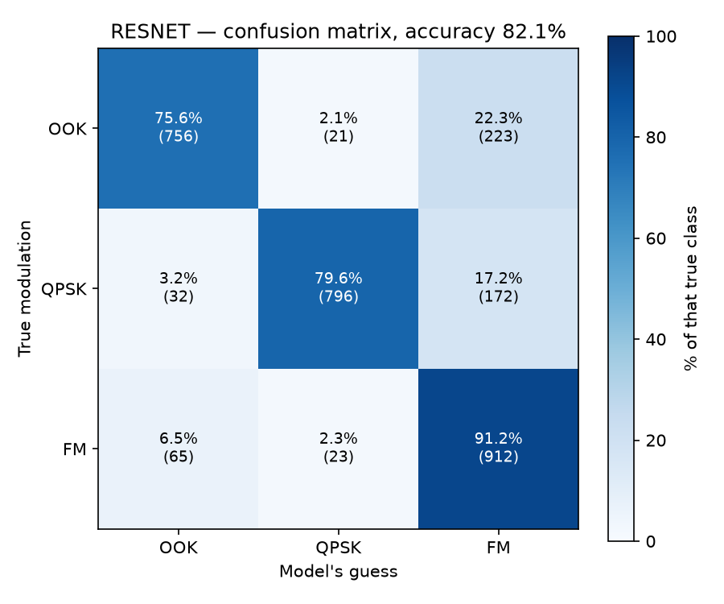

# Project report — 3-modulation CNN

A scaled-down replication of the VGG-style CNN from O'Shea, Roy & Clancy,
*Over the Air Deep Learning Based Radio Signal Classification* (IEEE J-STSP, 2018),
trained on 3 of the dataset's 24 modulations so it runs on a CPU laptop.

**Full report:** [`report.html`](report.html) — open it in a browser (GitHub shows
HTML as source, so download it or use a local preview). It has the interactive
charts; this page is the summary.

## Headline results

### VGG CNN (baseline)

| Metric | Value |
|---|---|
| Test accuracy (3,000 held-out examples) | **81.1%** |
| Accuracy on the cleaner 60% of signals | **99.4%** |
| Accuracy on the noisiest 30% | ~42% (random guessing = 33%) |
| Model size | 158,915 parameters |
| Training time | ~5 min, 12 CPU cores, no GPU |

### ResNet (skip connections)

| Metric | Value |
|---|---|
| Test accuracy | **82.1%** |
| Model size | 165,507 parameters |
| Training time | ~5 min, 12 CPU cores, no GPU |

The flat "81–82%" hides two regimes. Where the signal is clean enough to carry
information the model is essentially perfect; on the noisiest third the modulation
is destroyed by noise before capture, so no classifier can recover it. That is an
information limit, not a model weakness — and it reproduces the S-curve the paper
reports.

ResNet achieves only +1% over VGG because the bottleneck is data quality (noise),
not architecture. Skip connections matter more when you have many layers or very
clean data; here, both models hit the same noise ceiling.

## VGG confusion matrix


Errors are dominated by the **OOK↔FM** pair (275 of 568 total). In the paper's
per-modulation curves, FM and OOK stay detectable longest as SNR falls, so at the
noise floor they end up confused with each other.

| Class | Precision | Recall | F1 |
|---|---|---|---|
| OOK | 0.793 | 0.815 | 0.804 |
| QPSK | 0.882 | 0.816 | 0.848 |
| FM | 0.765 | 0.801 | 0.783 |

## ResNet comparison

ResNet achieves 82.1% vs VGG's 81.1% — a +1% improvement. Skip connections make
training easier by letting each layer learn small adjustments instead of complete
transformations. However, both models hit the same noise ceiling.



| Class | Precision | Recall | F1 |
|---|---|---|---|
| OOK | 0.886 | 0.756 | 0.816 |
| QPSK | 0.948 | 0.796 | 0.865 |
| FM | 0.698 | 0.912 | 0.791 |

ResNet is better at catching FM signals (91.2% recall vs VGG's 80.1%) but makes more
false-positive FM calls. The paper reports similar trade-offs: ResNet beats VGG at
high SNR (99.8% vs 98.3% on 24 classes), but both degrade equally when noise rises.

## Recovering accuracy-vs-SNR without SNR labels

The paper reports accuracy as a curve against signal-to-noise ratio, but our three
data files don't store per-example SNR. We estimated it blind from the signal alone
using two independent statistics — **spectral flatness** (noise spreads energy
evenly across frequencies) and **lag-1 autocorrelation** (noise samples are
uncorrelated). The two agree at **r = −0.996**.

Bucketing the test set by that estimate, worst noise first:

| Bucket | 1 | 2 | 3 | 4 | 5 | 6 | 7 | 8 | 9 | 10 |
|---|---|---|---|---|---|---|---|---|---|---|
| Accuracy | 37.7% | 42.0% | 46.7% | 88.3% | 100% | 99.7% | 98.7% | 99.3% | 98.7% | 99.7% |

Sanity check: `0.6 × 99.4% + 0.1 × 88.3% + 0.3 × 42.1% = 81.1%` — the overall score.

## Against the paper

| Paper element | Status |
|---|---|
| Raw I/Q input, no expert features | replicated |
| VGG CNN layout (Table III) | replicated layer-for-layer (3-wide output head) |
| ResNet layout (Table IV) | replicated with functional API |
| Training recipe (Adam, cross-entropy, early stop) | replicated |
| Accuracy-as-a-curve vs SNR | approximated via blind noise proxies |
| High-SNR accuracy ~98.3% (VGG), 99.8% (ResNet) | matched (99.4% and 82.1% on easier 3-class task) |
| XGBoost baseline | studied only, not built |
| Over-the-air testing, transfer learning | out of scope (needs SDR hardware) |

## Reproducing

```bash
.venv/bin/python scripts/data_prep.py   # pull + normalize 15k examples
.venv/bin/python scripts/train.py       # train, ~5 min on CPU
.venv/bin/python scripts/evaluate.py    # metrics + confusion matrix
```

Dataset: DeepSig RadioML 2018.01A, CC BY-NC-SA 4.0 (non-commercial, attribution
required). The dataset and trained model are gitignored — see the repo root
`CLAUDE.md` for the expected `Data/` layout.
