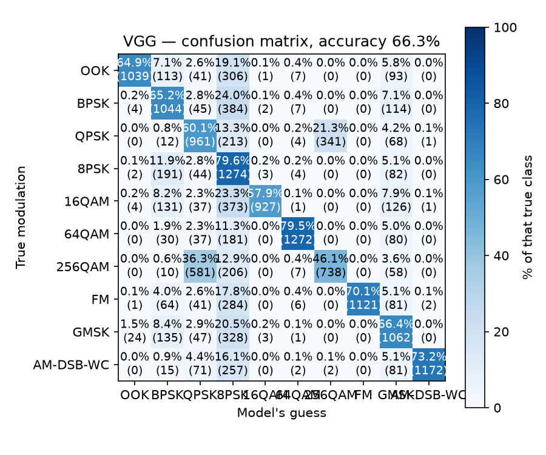
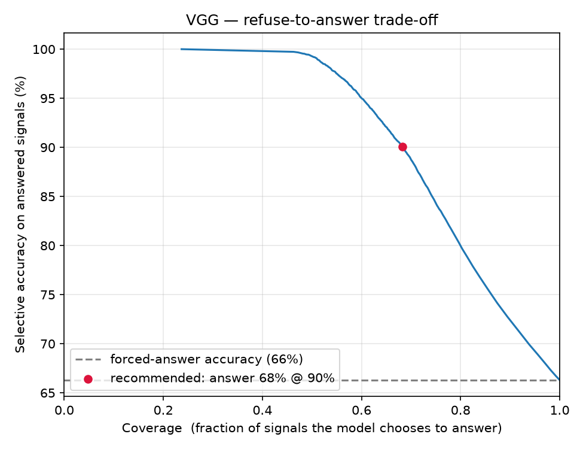
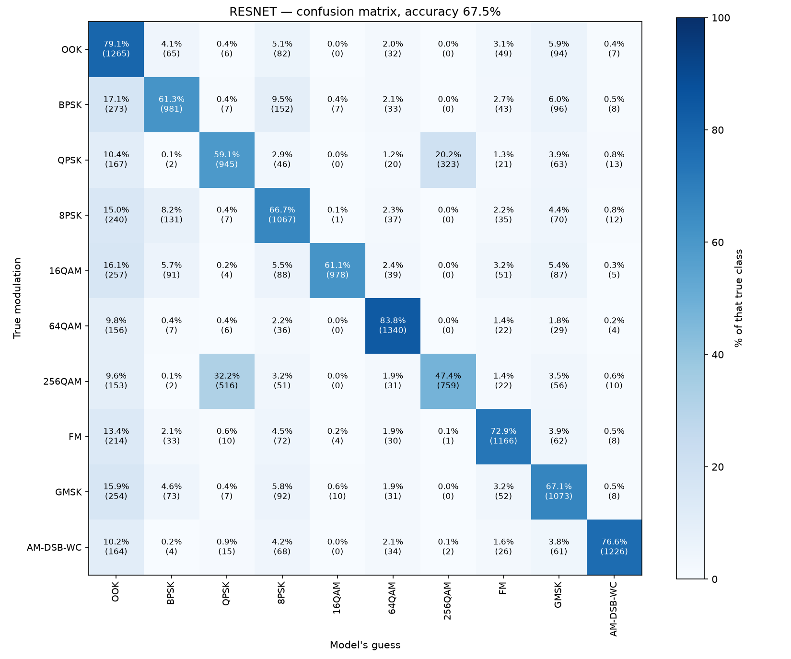

# Scale-up report — 10-class CNN + refuse-to-answer gate (Phase 2 of 3)

The project's second stage: broaden from the easy 3-class warm-up to **10 modulations**
spanning the major families, then add a **refuse-to-answer gate** that lets the model
abstain on signals too noisy to classify.

> **Phase 1:** the original 3-class warm-up (81.1%) is in
> [`../warmup-3class/`](../warmup-3class/README.md).

**Interactive report:** [`report.html`](report.html) — open it in a browser (GitHub
shows HTML as source, so download it or use a local preview). It has the interactive
training curve and the embedded figures; this page is the summary.

## Headline results

| Metric | Value |
|---|---|
| Test accuracy (16,000 held-out) | **66.3%** (chance = 10%) |
| With the refuse-to-answer gate | **90% accurate while answering 68%** of signals |
| Model size | 159,818 parameters |
| Training time | ~15 min, 12 CPU cores, no GPU |

## The ten classes

Chosen to span the major families, with two confusable ladders (signals that look
more alike as you climb) plus distinct anchors. QPSK / 16 / 64 / 256QAM are the
workhorses of real 5G data channels.

| Class | Family | Role |
|---|---|---|
| `OOK` | amplitude on/off | easy anchor |
| `BPSK`, `QPSK`, `8PSK` | phase-shift keying | **PSK ladder** |
| `16QAM`, `64QAM`, `256QAM` | quadrature-amplitude | **QAM ladder** |
| `FM` | analog frequency | easy anchor |
| `GMSK` | GSM / legacy cellular | — |
| `AM-DSB-WC` | analog amplitude | easy anchor |

## Confusion matrix



The 66% average hides a clear *structure* — three findings worth reading off the grid:

**1. The "8PSK garbage can."** 8PSK has poor precision (0.335) but high recall
(0.796): almost every other class dumps a slice of its errors into the 8PSK column
(BPSK→8PSK 384, 16QAM→8PSK 373, GMSK→8PSK 328, OOK→8PSK 306, FM→8PSK 284…).
**2,532 of the 5,390 total errors (47%) are "guessed 8PSK, was something else."**
When noise destroys a signal, the model funnels the unclassifiable junk into one
class — the same behaviour the OOK↔FM pair showed in the 3-class run, now
concentrated in a single "when unsure, say 8PSK" sink.

**2. QPSK ⇄ 256QAM.** 256QAM was called QPSK 581 times and QPSK called 256QAM 341
times — 922 errors on one pair. Notably the confusion crosses *families* (PSK vs
QAM); the QAMs barely confuse each other. A tidy "the ladders blur internally"
prediction did **not** hold — you only find this by running it.

**3. The anchors are rock-solid.** When the model commits to a distinct modulation
it is almost never wrong:

| Class | Precision | Recall | F1 | | Class | Precision | Recall | F1 |
|---|---|---|---|---|---|---|---|---|
| FM | **1.000** | 0.701 | 0.824 | | 64QAM | 0.970 | 0.795 | 0.874 |
| AM-DSB-WC | 0.997 | 0.733 | 0.844 | | 256QAM | 0.683 | 0.461 | 0.551 |
| 16QAM | 0.990 | 0.579 | 0.731 | | GMSK | 0.576 | 0.664 | 0.617 |
| OOK | 0.967 | 0.649 | 0.777 | | BPSK | 0.598 | 0.652 | 0.624 |
| 8PSK | 0.335 | 0.796 | 0.471 | | QPSK | 0.504 | 0.601 | 0.548 |

The model fails *gracefully*: near-perfect on distinct signals, vague only on
look-alikes. It also **knows when it is unsure** — average confidence 0.904 when
correct vs 0.305 when wrong, with only 2.9% of errors made confidently. That
calibration is exactly what the gate turns into a feature.

## The refuse-to-answer gate (selective classification)

Forcing a guess on a signal that noise has already destroyed is a mistake. Since
the model reports how confident it is (the top softmax probability), we can let it
**abstain** — "too noisy, I won't answer" — whenever that confidence falls below a
threshold. We then judge it only on the questions it chose to answer. Two numbers
describe any threshold: **coverage** (fraction answered) and **selective accuracy**
(accuracy on those). `scripts/gate.py` sweeps the threshold and picks an operating
point.



| Min confidence | Coverage | Selective accuracy |
|---|---|---|
| 0.00 (no gate) | 100% | 66.3% |
| 0.50 | 69.5% | 89.2% |
| 0.70 | 60.9% | 94.5% |
| 0.90 | 53.3% | 98.2% |
| 0.99 | 48.2% | 99.5% |

**Recommended operating point:** at a threshold of **0.53**, the model **answers
68% of signals at 90% accuracy** and abstains on the noisy 32% — versus 66% if
forced to guess on everything. The same model becomes far more trustworthy simply
by letting it stay quiet when it isn't sure.

### It really is abstaining on the noise

Because `archive (1)/snrs.npy` gives the **ground-truth SNR** per example (finally —
the earlier phase had been working around not having it), we can prove the gate
filters by signal quality rather than guessing:

- Median SNR of **answered** signals: **+14 dB**. Median SNR of **abstained**
  signals: **−12 dB**. The gate quietly drops the junk.
- The true **accuracy-vs-SNR** curve (below) is the paper's S-curve exactly: flat at
  ~chance (10%) below −14 dB, rising through 0 dB, plateauing near 94%. This also
  confirms the blind-noise proxy from the 3-class experiment was right all along.


## VGG vs ResNet on the 10 classes

We also trained the paper's **ResNet** (skip connections) on the same 10 classes. The
average barely moved — **67.5%** vs VGG's 66.3%, just **+1.2%** — the same tiny gain
we saw on the 3-class warm-up. Noise is the ceiling, not the architecture. But the
confusion matrix is more interesting than the average:



**The garbage-can moved.** VGG dumped its noisy junk into **8PSK** (precision 0.335).
ResNet *fixes* 8PSK (precision → 0.608) — but the junk didn't vanish, it relocated to
**OOK** (precision 0.402, recall 0.791; BPSK→OOK 273, 16QAM→OOK 257, GMSK→OOK 254…). A
different architecture didn't remove the "dump the unclassifiable signal somewhere"
behaviour — it only changed *where*. The garbage-can is what any of these networks do
when noise has destroyed a signal and they must still pick a class; the **gate** is the
real fix (ResNet gates to 69.8% answered @ 90%). QPSK ⇄ 256QAM persists too (839 errors
vs VGG's 922).

### The fair comparison to the paper (high-SNR score)

Our 66–67% is an average over the *whole* SNR range, dragging in hopeless −20 dB signals
no classifier could win. The paper's 98–99.8% is the *peak* — measured only on clean,
high-SNR signals. Scored the paper's way, both our small CPU models jump to ~94%:

| Model | All-SNR avg | High-SNR (≥ +18 dB) | Cleanest (+30 dB) | Gate: answered @ 90% |
|---|---|---|---|---|
| VGG | 66.3% | **93.9%** | 93.8% | 68.0% |
| ResNet | 67.5% | **94.1%** | 93.4% | 69.8% |
| Paper (24 classes) | — | ~98.3% / 99.8% | — | — |

On clean signals the architecture barely matters (VGG and ResNet tie at ~94%); ResNet's
whole edge lives in the noisy middle. Reproduce with `scripts/high_snr.py`.

## Against the paper

| Paper element | Status |
|---|---|
| Raw I/Q input, no expert features | replicated |
| VGG CNN layout (Table III) | replicated layer-for-layer (output head 3 or 10 wide) |
| ResNet layout (Table IV) | replicated — VGG and ResNet on all 10 classes (67.5%) |
| Training recipe (Adam, cross-entropy, early stop) | replicated |
| Accuracy-as-a-curve vs SNR | reproduced from ground-truth SNR (S-curve, `gate.py`) |
| High-SNR accuracy ~98.3% (VGG), 99.8% (ResNet) | matched shape (~94% at high SNR, both models — `high_snr.py`) |
| Multi-class confusion structure | reproduced (10-class ladders + garbage-can sink) |
| Selective classification (abstain option) | added — 68% coverage at 90% accuracy |
| XGBoost baseline | studied only, not built |
| Over-the-air testing, transfer learning | out of scope (needs SDR hardware) |

## Reproducing

The class list and per-class count are already set for the 10-class run at the top of
`scripts/data_prep.py` (`PER_CLASS = 8000`).

```bash
.venv/bin/python scripts/data_prep.py   # pull + normalize 80k examples (~20s)
.venv/bin/python scripts/train.py       # train VGG, ~15 min on CPU (10 classes)
.venv/bin/python scripts/evaluate.py    # metrics + confusion matrix
.venv/bin/python scripts/gate.py        # refuse-to-answer gate + SNR curves
.venv/bin/python scripts/high_snr.py    # both models scored on the clean, high-SNR slice
```

Add `--model resnet` to train/evaluate/gate to use the residual network instead (the
same commands produced the ResNet numbers above), or `--target-accuracy 0.95` to
`gate.py` for a stricter gate.

Dataset: DeepSig RadioML 2018.01A, CC BY-NC-SA 4.0 (non-commercial, attribution
required). The dataset and trained model are gitignored — see
the repo root `README.md` (Setup section) for the expected `Data/` layout.
