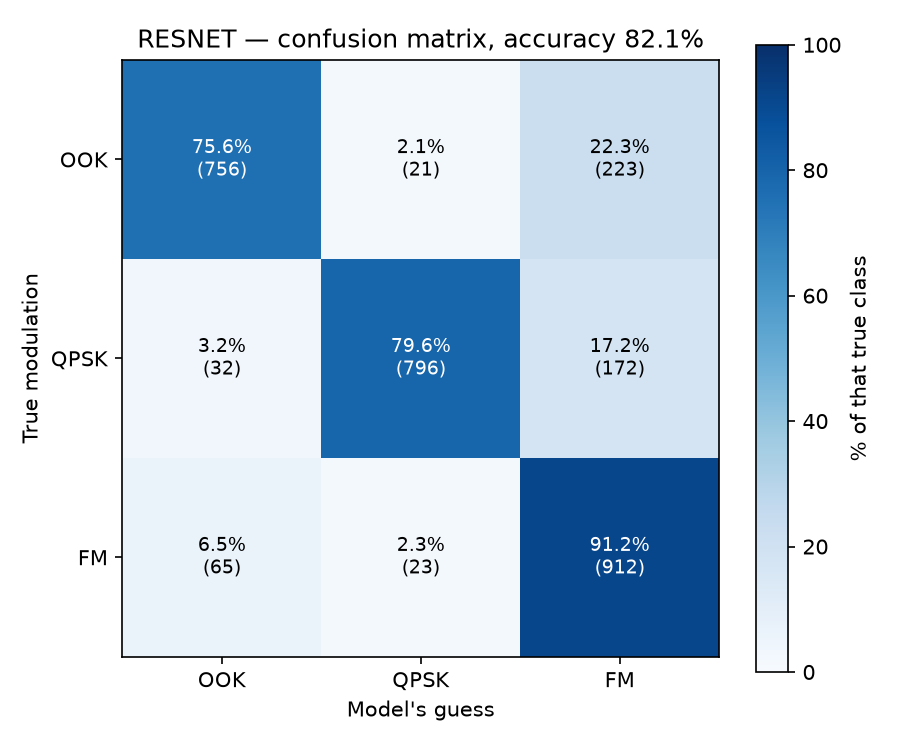

# Warm-up report — 3-class CNN (Phase 1 of 2)

The project's first stage: a scaled-down replication of the VGG-style CNN from
O'Shea, Roy & Clancy, *Over the Air Deep Learning Based Radio Signal Classification*
(IEEE J-STSP, 2018), trained on **3 physically distinct modulations** so it runs on a
CPU laptop and gives an encouraging first result.

> **Phase 2:** the project later scaled up to 10 modulations with a refuse-to-answer
> gate — see [`../scaleup-10class/`](../scaleup-10class/README.md).

**Interactive report:** [`report.html`](report.html) — open it in a browser (GitHub
shows HTML as source, so download it or use a local preview). It has the interactive
charts (training curve, confusion matrix, noise buckets); this page is the summary.

## The three classes

Three physically distinct modulations (OOK / QPSK / FM), 5,000 examples each, picked
to be easy to tell apart.

| Class | Full name | How it carries data |
|---|---|---|
| `OOK` | On-Off Keying | switches the carrier on and off |
| `QPSK` | Quadrature Phase-Shift Keying | jumps between four phase angles |
| `FM` | Frequency Modulation | bends the carrier frequency continuously |

## Headline results

| Metric | Value |
|---|---|
| Test accuracy (3,000 held-out) | **81.1%** |
| Accuracy on the cleaner 60% of signals | **99.4%** |
| Accuracy on the noisiest 30% | ~42% (chance = 33%) |
| Model size | 158,915 parameters |
| Training time | ~5 min, 12 CPU cores, no GPU |

That flat 81% is an average of two regimes: near-perfect where the signal is clean,
near-chance where noise destroyed the modulation before capture. That is an
information limit, not a model weakness — and it reproduces the S-curve the paper
reports. (The VGG confusion matrix is the interactive SVG inside `report.html`; the
per-class numbers are OOK 0.793 / QPSK 0.882 / FM 0.765 precision, and errors are
dominated by the OOK↔FM pair — 275 of 568 total.)

## Recovering accuracy-vs-SNR without SNR labels

The paper reports accuracy as a curve against signal-to-noise ratio, but at this stage
we didn't yet have per-example SNR. We estimated it blind from the signal alone using
two independent statistics — **spectral flatness** (noise spreads energy evenly across
frequencies) and **lag-1 autocorrelation** (noise samples are uncorrelated). The two
agree at **r = −0.996**.

Bucketing the 3-class test set by that estimate, worst noise first:

| Bucket | 1 | 2 | 3 | 4 | 5 | 6 | 7 | 8 | 9 | 10 |
|---|---|---|---|---|---|---|---|---|---|---|
| Accuracy | 37.7% | 42.0% | 46.7% | 88.3% | 100% | 99.7% | 98.7% | 99.3% | 98.7% | 99.7% |

Sanity check: `0.6 × 99.4% + 0.1 × 88.3% + 0.3 × 42.1% = 81.1%` — the overall score.
(Phase 2 later obtained the **ground-truth** SNR and confirmed this blind estimate was
right — see the scale-up report's SNR validation.)

## VGG vs ResNet (3-class)

We also built the paper's ResNet (skip connections). It reached **82.1%** vs VGG's
81.1% — only **+1%**, because the bottleneck is data quality (noise), not architecture.
Skip connections make training easier by letting each layer learn a small adjustment
instead of a full transformation, but they cannot recover information noise already
destroyed. Both models hit the same ceiling.



| Class | Precision | Recall | F1 |
|---|---|---|---|
| OOK | 0.886 | 0.756 | 0.816 |
| QPSK | 0.948 | 0.796 | 0.865 |
| FM | 0.698 | 0.912 | 0.791 |

## Reproducing

Set `CHOSEN_CLASSES = ["OOK", "QPSK", "FM"]` and `PER_CLASS = 5000` at the top of
`scripts/data_prep.py`, then:

```bash
.venv/bin/python scripts/data_prep.py   # pull + normalize 15k examples
.venv/bin/python scripts/train.py       # train VGG, ~5 min on CPU
.venv/bin/python scripts/evaluate.py    # metrics + confusion matrix
```

Add `--model resnet` to train/evaluate for the residual network.

Dataset: DeepSig RadioML 2018.01A, CC BY-NC-SA 4.0 (non-commercial, attribution
required). The dataset and trained model are gitignored — see the repo root
`CLAUDE.md` for the expected `Data/` layout.
